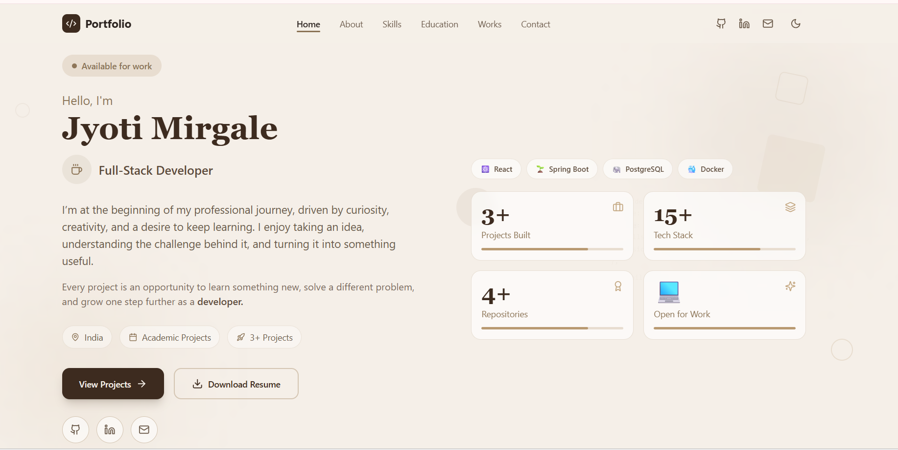
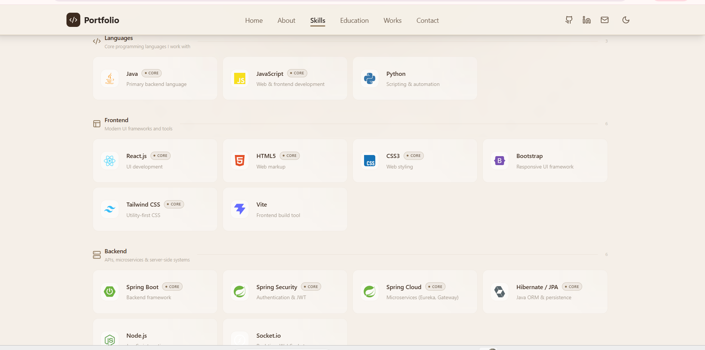
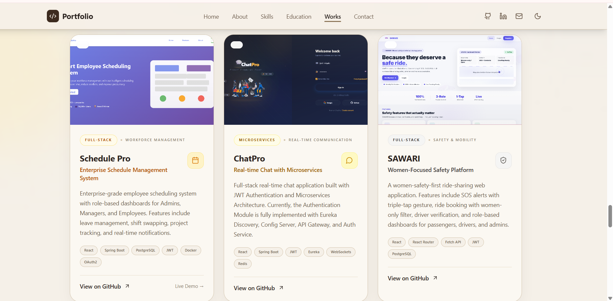

# Jyoti Mirgale — Java Full-Stack Developer Portfolio

A modern and responsive developer portfolio showcasing my skills, projects, education, certifications, and experience in building full-stack web applications.
I'm a Computer Science graduate and aspiring Java Full-Stack Developer who enjoys turning ideas into practical web applications. I’m curious, detail-oriented, and always looking for opportunities to learn, build, and grow as a developer.

🔗 **Live Portfolio:**  
https://jyoti-portfolio-eyax.onrender.com

📄 **Resume:**  
[Download Resume](./public/Resume.pdf)

---
## 📸 Portfolio Screenshots

### Landing Page



### Skills Section



### Projects Section



---

## ✨ Portfolio Features

- Responsive and modern portfolio design
- Developer-focused hero section
- About Me section
- Interactive technical skills showcase
- Education timeline
- Certifications section
- Featured projects
- Project screenshots
- GitHub project links
- Functional contact section
- Resume download
- Dark / Light theme toggle
- Responsive desktop, tablet, and mobile layouts
- Smooth navigation between sections
- Clean UI with Tailwind CSS

---

## 🛠️ Tech Stack

### Frontend

- React.js
- JavaScript
- Vite
- Tailwind CSS
- Lucide React
- HTML5
- CSS3

### Backend

- Java
- Spring Boot
- Spring Security
- REST APIs
- JWT Authentication
- Microservices

### Databases

- PostgreSQL
- MySQL
- Redis

### Tools & Technologies

- Git
- GitHub
- Docker
- Maven
- VS Code
- IntelliJ IDEA

---

# 🚀 Featured Projects

## 1. SchedulePro

### Enterprise Scheduling & Resource Allocation System

SchedulePro is a full-stack workforce management application designed to simplify employee scheduling, resource allocation, and workforce coordination.

### Key Features

- Role-based authentication
- Admin, Manager, and Employee workflows
- Employee management
- Project management
- Workforce scheduling
- Resource allocation
- JWT-based authentication
- RESTful APIs
- PostgreSQL database
- Responsive React interface
- Docker-based deployment environment

### Technologies

**Java | Spring Boot | Spring Security | JWT | React.js | PostgreSQL | Docker | Maven**

🔗 **Repository:**  
https://github.com/Jyotimirgale25/schedulepro

**Status:** Completed

---

## 2. ChatPro

### Enterprise Communication Platform

ChatPro is a communication platform designed using a **microservices architecture** to support secure and scalable real-time communication.

### Key Features

- JWT authentication
- Refresh-token authentication
- Google OAuth2 login
- Role-based access control
- Two-factor authentication
- Email/OTP verification
- Session management using Redis
- One-to-one messaging
- Group chat
- Channel-based communication
- Typing indicators
- User presence
- Secure API Gateway
- Service discovery

### Microservices Architecture

- Discovery Service — Eureka
- Config Service — Spring Cloud Config
- API Gateway — Spring Cloud Gateway
- Common Library — Shared DTOs and utilities

### Technologies

**Java | Spring Boot | Spring Security | Spring Cloud | Microservices | Eureka | Redis | JWT | React.js**

🔗 **Repository:**  
https://github.com/Jyotimirgale25/chatpro

**Status:** In Progress

---

## 3. SAWARI

### Women's Safety Ride-Sharing Platform — Academic Project

SAWARI is an **academic frontend project** focused on designing a women-oriented ride-sharing experience with safety-focused features and a clean, accessible user interface.

The project primarily focuses on **frontend development, user experience, responsive design, and safety-oriented interface concepts**.

### Key Features

- Women-focused ride-sharing interface
- Safety-oriented user interface
- SOS feature interface
- Driver verification interface
- Responsive design
- User-friendly navigation
- Clean and accessible UI
- Mobile-friendly layout

### Technologies

**React.js | JavaScript | Tailwind CSS**

🔗 **Repository:**  
https://github.com/Jyotimirgale25/sawari-frontend

**Status:** Completed — Academic Frontend Project

---

# 📂 Project Structure

```text
jyoti-portfolio/
│
├── public/
│   └── Jyoti_Mirgale_Resume.pdf
│
├── screenshot/
│   ├── landing.png
│   ├── skills.png
│   ├── project.png
│   ├── chatpro.png
│   ├── schedulepro.png
│   └── sawari.png
│
├── src/
│   ├── components/
│   │   ├── illustrations/
│   │   ├── About.jsx
│   │   ├── Certifications.jsx
│   │   ├── Contact.jsx
│   │   ├── CTABanner.jsx
│   │   ├── Education.jsx
│   │   ├── Hero.jsx
│   │   ├── MyWork.jsx
│   │   ├── Navbar.jsx
│   │   ├── TechStack.jsx
│   │   ├── Footer.jsx
│   │   └── ThemeToggle.jsx
│   │
│   ├── hooks/
│   │   └── useTheme.js
│   │
│   ├── App.jsx
│   ├── main.jsx
│   └── index.css
│
├── index.html
├── package.json
├── tailwind.config.js
└── README.md
````

---

# ⚙️ Getting Started

## Prerequisites

Make sure you have the following installed:

* Node.js
* npm
* Git

## Clone the Repository

```bash
git clone https://github.com/Jyotimirgale25/jyoti-portfolio.git
```

## Navigate to the Project

```bash
cd jyoti-portfolio
```

## Install Dependencies

```bash
npm install
```

## Start Development Server

```bash
npm run dev
```

The application will be available at:

```text
http://localhost:5173
```

---

# 📦 Build for Production

Create a production build:

```bash
npm run build
```

Preview the production build locally:

```bash
npm run preview
```

---

# 🌐 Deployment

The portfolio is deployed using **Render**.

🔗 **Live Website:**

[https://jyoti-portfolio-eyax.onrender.com](https://jyoti-portfolio-eyax.onrender.com)

The production build is generated using Vite.

---

# 📄 Resume

My resume is available directly from the portfolio:

[Download Resume](./public/Jyoti_Mirgale_Resume.pdf)

---

# 📬 Contact

I'm currently open to opportunities as a **Java Full-Stack Developer** and interested in building scalable, secure, and user-friendly applications.

### Jyoti Mirgale

📍 Pune, Maharashtra, India

📧 **Email:**
[jyotimirgale101@gmail.com](mailto:jyotimirgale101@gmail.com)

💻 **GitHub:**
[https://github.com/Jyotimirgale25](https://github.com/Jyotimirgale25)

🌐 **Portfolio:**
[https://jyoti-portfolio-eyax.onrender.com](https://jyoti-portfolio-eyax.onrender.com)

---

# 🎯 Career Objective

To start my career as a **Java Full-Stack Developer** where I can apply my knowledge of Java, Spring Boot, React.js, databases, and modern development tools while continuously learning and contributing to real-world software projects.

---

## ⭐ Feedback

If you find this portfolio useful or interesting, feel free to explore the projects and repositories.

**Thank you for visiting my portfolio!**

````

### One important correction for your files

From the VS Code screenshot you showed earlier, your screenshots are currently in:

```text
jyoti-portfolio/
└── screenshot/
    ├── landing.png
    ├── skills.png
    └── project.png
````

So I used:

```markdown

```

**not**:

```markdown

```

That old path would be incorrect on GitHub.

Also, because you moved your resume to `public`, this README correctly uses:

```markdown
[Download Resume](./public/Jyoti_Mirgale_Resume.pdf)
```

This version is much more suitable for your GitHub repository and consistent with your **current Render deployment and three projects: SchedulePro, ChatPro, and SAWARI**.
